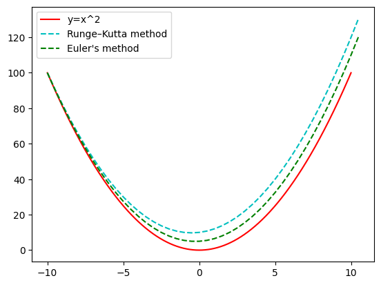

# Comparison of Euler's and Runge-Kutta methods
**You can checkout code in the notebook at the repo _(including those methods)_.**
## $\space y' = sin(t)^2 y, \space N=50$

    

    

## Lotka-Volterra equations, $\space N=1000$
    

    

## $y = x^2,  \space N=40$
   

    

